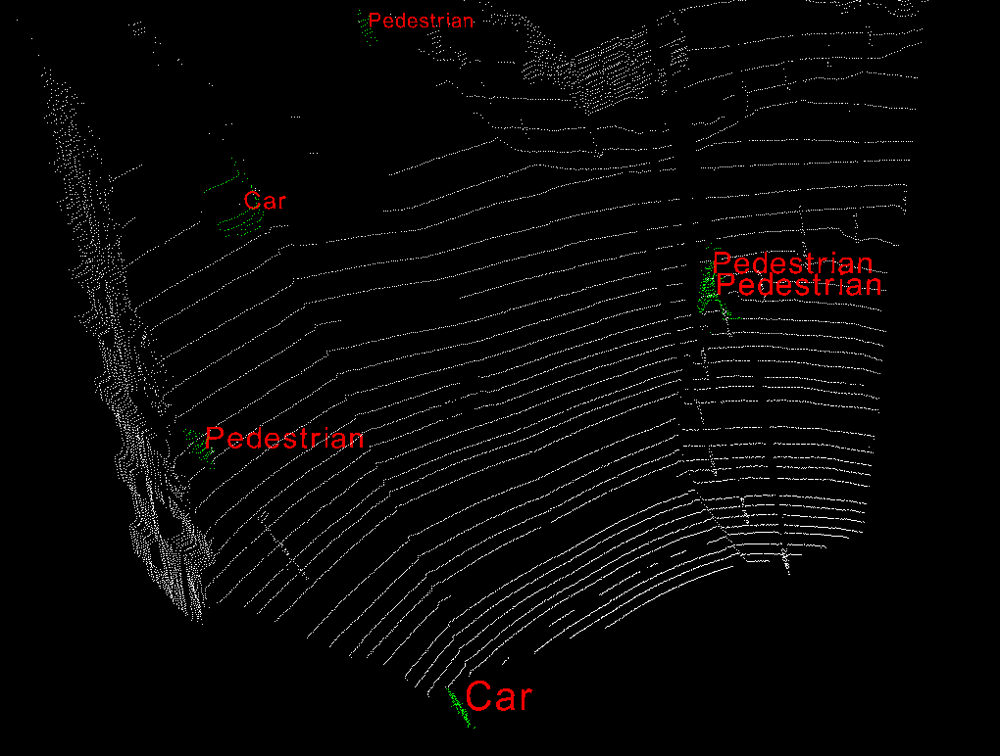

# Random Forest Classifier

An OpenCV random classifier to classify clusters into different semantic labels.

This is a small implement of *SegMatch:SegMatch: Segment based place recognition in 3D point clouds*.

For more details about trainning and predicting, please refer to the demos in /demo.

Performance:

